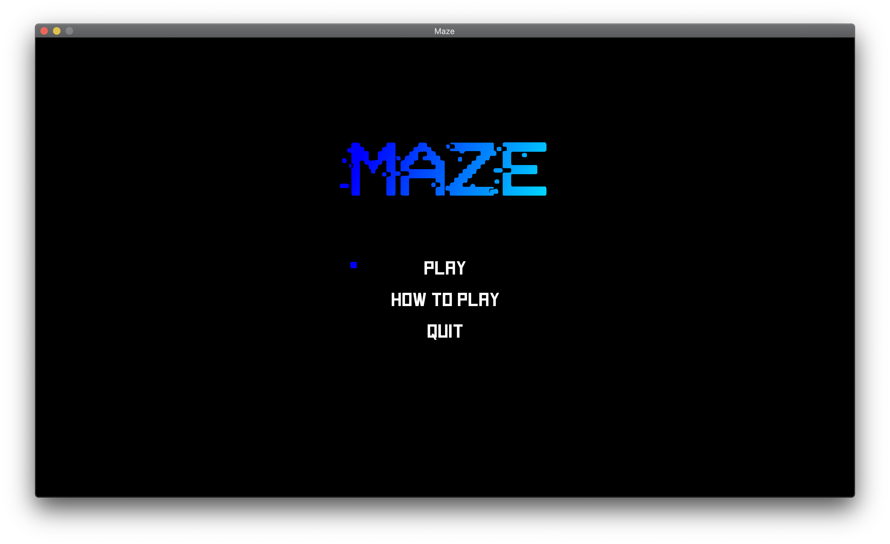
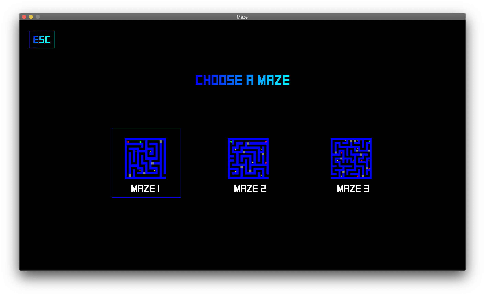
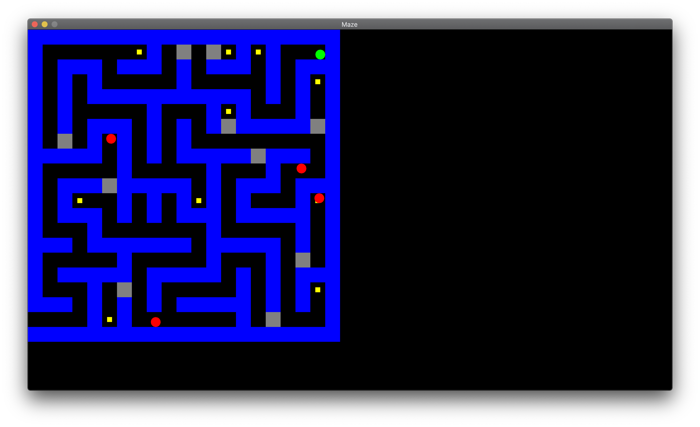

# Maze

This maze game was created for my AP Computer Science A final. 

Run `Maze.java` to play.

This game has 3 different mazes to play. Each level is more difficult than the last. The levels can be played in any order.
Your only goal is to exit the maze alive. Avoid monsters. Doors are gray and can be opened by collecting yellow keys. After a key is collected, a portal appears. Portals can be used for fast travel. 

---

## Controls

* Navigate menus with the *arrow keys*.
* Press `ENTER` to select an item.
* Press `ESC` to go back.
* Use `WASD` to move.
* Press `ESC` to pause.

---

## Screenshots

### Main Menu

### Level Select

### Maze

